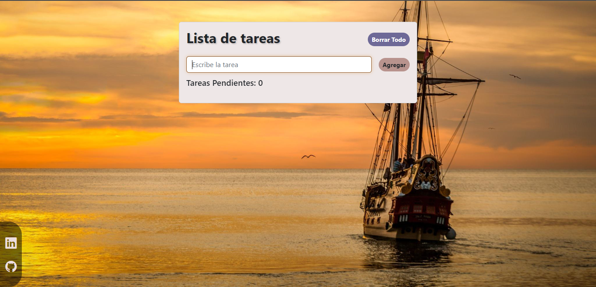

# Todo List app

Todo list app created with React, Javascript and Bootstrap.
I used for the first time the React hot toast library to generate different notifications and also used local storage to save the data.

## Screenshots

---

## Link

Todo list site: [Todo List app](https://todo-list-with-react.vercel.app/)

## Built with

- React
- Javascript
- CSS
- Bootstrap
- React hot toast notifications
